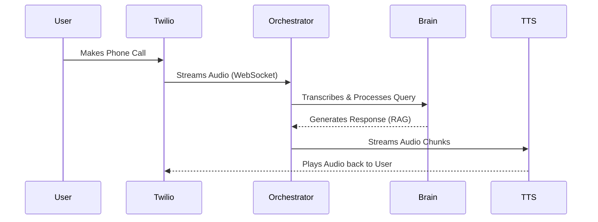

# 🎙️ CILA: AI Voice Agent

A production-ready AI Voice Agent for GD College, designed for high-performance telephony and automated admission support.

## � Simple Flow



## 🚀 Quick Start

1. **Install Dependencies**:
   ```bash
   pip install -r requirements.txt
   ```

2. **Run the Server**:
   ```bash
   python run_server.py
   ```

3. **Expose to Twilio**:
   ```bash
   ngrok http 8085
   ```

---
**Status**: 🟢 PRODUCTION READY
